# LOOM Parameter Guide for Map Designers

LOOM renders transit maps from line-graph data. It is a pipeline of four tools that each
control a different stage of the process:

```
Input GeoJSON  ->  [topo]  ->  loom  ->  [octi]  ->  transitmap  ->  SVG
(line graph)      cleanup   ordering   schematic     rendering
```

`topo` and `octi` are optional. Run just `loom -> transitmap` for a geographically-correct
layout, or add `octi` for a schematic (subway-diagram) style.

The algorithms behind LOOM are described in a series of research papers by
Hannah Bast and Patrick Brosi (University of Freiburg) — see [References](#references) at the end of this document.

---

## Quick visual guide

The most impactful parameters for the look of your map:

| Parameter | What it changes |
|---|---|
| `--line-width` | How thick each line stripe is |
| `--line-spacing` | Gap between parallel lines |
| `--outline-width` | Black halo around each line |
| `--smoothing` | How curved the bends are |
| `--tight-stations` | Whether stations expand outward |
| `octi --grid-size` | How schematic vs geographic the layout is |
| `octi --base-graph` | The routing grid (octilinear / ortholinear / orthoradial / quadtree / octihanan) |

---

## `transitmap` — Rendering

`transitmap` is the last step. It reads the optimized line graph and draws the SVG.
All visual parameters live here. Changing them only re-runs this one step (no re-optimization needed).

### `--line-width` (default: 20)

Width in SVG units of a single transit line stripe.
Scale `--line-spacing` proportionally when you change this.

| `--line-width 10  --line-spacing 5` | `--line-width 20  --line-spacing 10` | `--line-width 40  --line-spacing 20` |
|---|---|---|
| 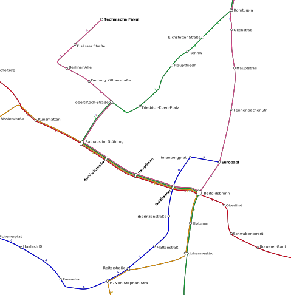 |  | 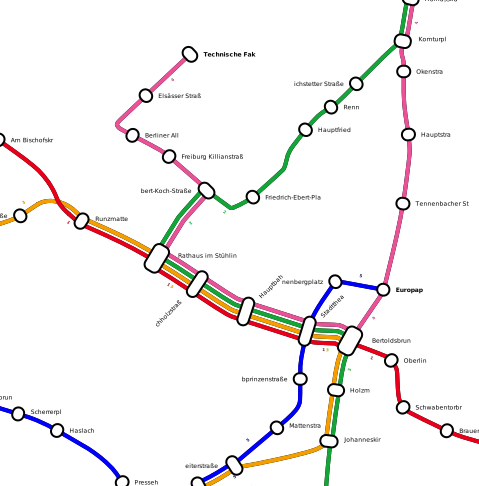 |

---

### `--line-spacing` (default: 10)

Gap in SVG units between adjacent parallel line stripes.
Setting this to `0` makes lines touch; increasing it opens space between them.

| `--line-spacing 0` | `--line-spacing 10` | `--line-spacing 20` |
|---|---|---|
| 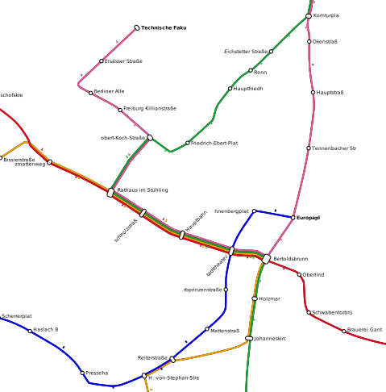 |  | 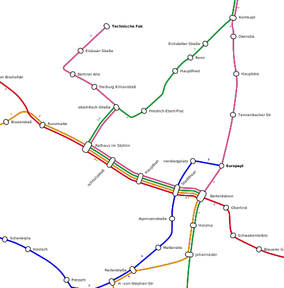 |

---

### `--outline-width` (default: 1)

Width of the black outline drawn around each line stripe.
Outlines separate lines visually when they run parallel. Set to `0` to remove them.

| `--outline-width 0` | `--outline-width 1` | `--outline-width 4` |
|---|---|---|
|  |  |  |

---

### `--smoothing` (default: 1)

Controls how much the input line geometry is smoothed before rendering.
`0` gives sharp angular bends. Higher values produce rounder curves.

| `--smoothing 0` | `--smoothing 1` | `--smoothing 3` |
|---|---|---|
|  |  | 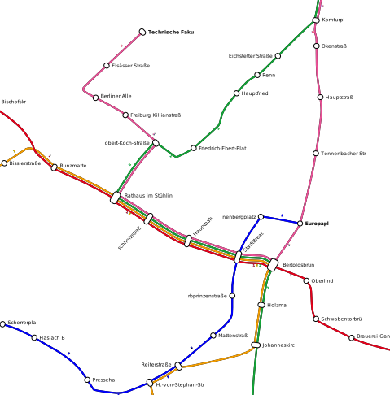 |

---

### `--labels` (flag)

Enables station name rendering. Without it, no text is drawn.

| Without `--labels` | With `--labels` |
|---|---|
|  |  |

---

### `--no-deg2-labels`

Suppresses labels for pass-through stations (degree-2 nodes),
keeping only terminal and interchange station names. Useful for reducing clutter.
Only has effect when `--labels` is also set.

---

### `--line-label-textsize` (default: 40)

Font size in SVG units for the route identifier drawn along each line segment.

---

### `--station-label-textsize` (default: 60)

Font size in SVG units for station name labels.

---

### `--tight-stations`

By default, stations cause the line bundle to fan out into individual stripes ("front expansion"),
making station locations clearly visible. `--tight-stations` disables this, keeping the bundle compact
through stations. Use when you want a cleaner look or when station markers are too large.

| Default (fan out) | `--tight-stations` |
|---|---|
|  | 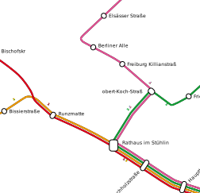 |

---

### `--no-render-stations`

Hides all station shapes entirely. Only the line geometry is drawn.
Useful for a very minimal look or when you intend to add custom station markers in post-processing.

| Default (stations shown) | `--no-render-stations` |
|---|---|
| 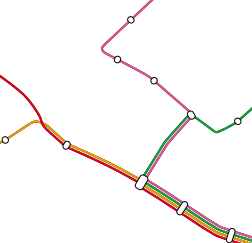 | 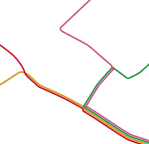 |

---

### `--no-render-node-connections`

Hides the rounded connectors drawn at junctions where multiple line bundles meet.
Useful for a more minimal aesthetic.

| Default (connectors shown) | `--no-render-node-connections` |
|---|---|
|  | 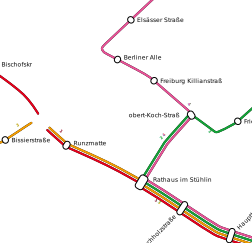 |

---

### `--render-node-fronts`

Renders the node front boundaries at each station as visible lines.
Normally these internal layout boundaries are invisible; enabling them shows the
station geometry used internally by the renderer.

| Default | `--render-node-fronts` |
|---|---|
| 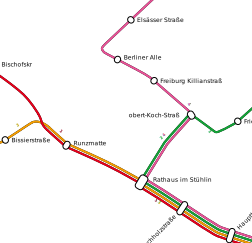 |  |

---

### `--render-dir-markers`

Renders small direction arrows along each line, indicating the direction of travel.
Useful for networks where direction matters (e.g., one-way lines or tidal flows).

| Without direction markers | `--render-dir-markers` |
|---|---|
|  |  |

---

### `--padding` (default: -1)

Extra whitespace added around the entire map in SVG units. `-1` means automatic padding.
Increase this if labels are getting clipped at the edges of the output.

---

### `--random-colors`

Assigns random colors to any lines that have no color defined in the input data.
Useful for quickly previewing a network without setting up colors first.

---

### `--render-engine` (default: `svg`)

Output format: `svg` produces a single SVG file on stdout. `mvt` produces
Mapbox Vector Tiles written to disk (see `--mvt-path` and `--zoom`).
For all map-design use cases, leave this as `svg`.

### `--zoom` (default: 14) / `--mvt-path` (default: `.`)

Only relevant when `--render-engine mvt` is used.
`--zoom` sets the tile zoom level (comma-separated or range, e.g. `12-15`).
`--mvt-path` sets the output directory for MVT tiles.

---

## `loom` — Line Ordering

`loom` decides in what order parallel lines are stacked when they share a track segment.
This is an optimization problem: minimizing crossings and separations between lines
as they diverge and rejoin at junctions. The algorithm is described in [[1]](#ref1) (SIGSPATIAL 2018)
and its extended journal version [[2]](#ref2). Transit App's engineering blog [[5]](#ref5) has a
readable account of why this ordering problem matters visually and how ILP solves it at scale.

### `--optim-method` (default: `comb-no-ilp`)

The algorithm used to solve the ordering problem. The effect is most visible at junctions.

The ILP method (`ilp`, `ilp-naive`) finds a provably optimal ordering by solving an Integer
Linear Program [[1]](#ref1). Engineering reductions described in [[2]](#ref2) bring typical solve times
from hours (naive formulation) to under a second. The combined method (`comb-no-ilp`, `comb`)
first applies local transformation rules that determine partial orderings without the ILP, then
invokes the ILP only for the remaining undecided edges.

| Value | Speed | Quality | Description |
|---|---|---|---|
| `comb-no-ilp` | Fast | Good | Combined heuristic (recommended default) |
| `comb` | Slower | Better | Combined heuristic with optional ILP fallback |
| `ilp` / `ilp-naive` | Slow | Optimal | Integer linear programming (requires solver) |
| `exhaust` | Very slow | Optimal | Exhaustive search (tiny networks only) |
| `greedy` | Very fast | OK | Greedy edge ordering |
| `greedy-lookahead` | Fast | Better | Greedy with lookahead |
| `hillc` / `hillc-random` | Fast | Good | Hill-climbing local search |
| `anneal` / `anneal-random` | Slow | Good | Simulated annealing |
| `null` | Instant | None | No optimization (shows default ordering) |

Compare `null` (no optimization) to the default optimizer — notice fewer crossings on the right:

| `--optim-method null` | `--optim-method comb-no-ilp` |
|---|---|
|  |  |

---

### Crossing and separation penalties

These penalties define the objective function minimized by the optimizer [[1]](#ref1)[[2]](#ref2).
Higher values make the optimizer try harder to avoid that particular type of crossing or separation.

| Parameter | Default | Meaning |
|---|---|---|
| `--same-seg-cross-pen` | 4 | Penalty for two lines crossing on the same edge segment |
| `--diff-seg-cross-pen` | 1 | Penalty for lines crossing across different segments |
| `--in-stat-cross-pen-same-seg` | 12 | Same-segment crossing penalty inside a station |
| `--in-stat-cross-pen-diff-seg` | 3 | Cross-segment crossing penalty inside a station |
| `--sep-pen` | 3 | Penalty for lines that share a route being separated by another line |
| `--in-stat-sep-pen` | 9 | Separation penalty inside a station |

Station penalties are higher by default because crossings at stations are more visible.

---

### `--no-untangle`

Disables the untangling pre-processing step that resolves some ordering conflicts before
the main optimizer runs. Turning this off may increase solve time or degrade quality.
Rarely needed; useful for debugging to isolate the effect of untangling.

| Default | `--no-untangle` |
|---|---|
| 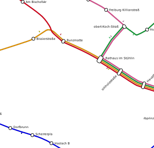 | 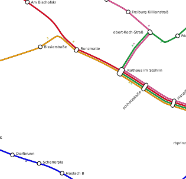 |

---

### `--no-prune`

Disables the pruning step that removes redundant ordering constraints before optimization.
Rarely needed; included for completeness and debugging.

---

### ILP solver settings

These apply when `--optim-method` is `ilp`, `ilp-naive`, or `comb`.

| Parameter | Default | Meaning |
|---|---|---|
| `--ilp-solver` | `gurobi` | Preferred solver: `gurobi`, `cbc`, or `glpk`. Falls back if not available. |
| `--ilp-num-threads` | `0` | Threads given to the ILP solver. `0` = solver default. |
| `--ilp-time-limit` | `-1` | Time limit in seconds. `-1` = no limit. |

---

## `octi` — Schematization (optional)

`octi` turns the geographically-accurate layout into a schematic metro-map diagram.
It maps each station onto a grid and routes connections using the allowed grid directions.
The core algorithm — placing stations on an octilinear grid and finding connecting paths —
is described in [[3]](#ref3) (EuroVis 2020). The extension to flexible grid types
(ortholinear, orthoradial, Hanan grids) is described in [[4]](#ref4) (SSTD 2021).

Skip `octi` entirely if you want a geographically-accurate map.

### `--optim-mode` (default: `heur`)

| Value | Description |
|---|---|
| `heur` | Greedy shortest-path heuristic. Runs in under 3 seconds; within ~7.5% of optimal on evaluated networks [[3]](#ref3). |
| `ilp` | Integer linear programming. Provably optimal but slow; practical only for small networks. |

---

### `--grid-size` (default: `100%`)

Size of each grid cell — either an absolute SVG unit or a percentage of the average
distance between adjacent stations. Smaller cells keep more geographic detail;
larger cells produce more spacing and a cleaner schematic look.

| Geographic (no octi) | `--grid-size 50%` | `--grid-size 100%` | `--grid-size 200%` |
|---|---|---|---|
| 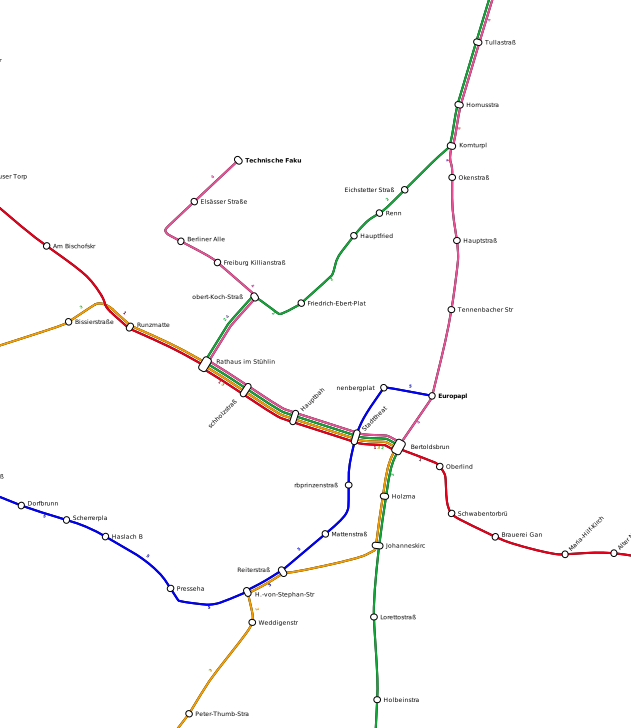 | 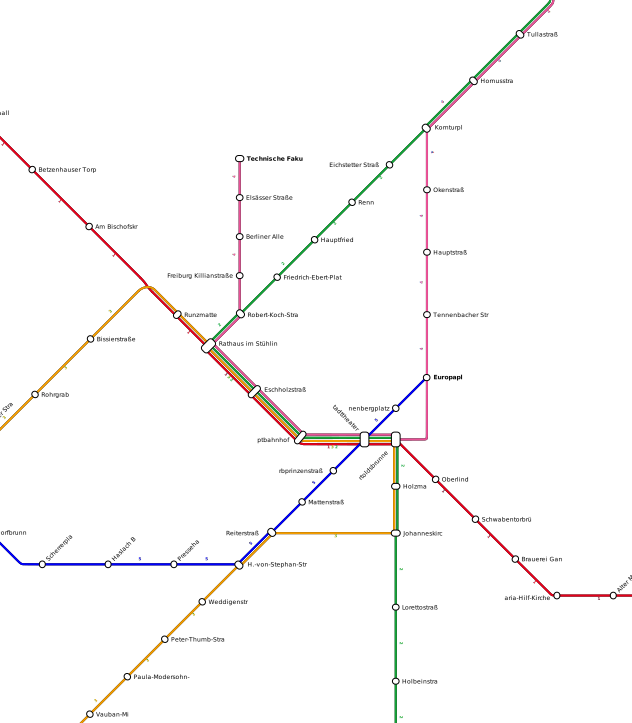 |  | 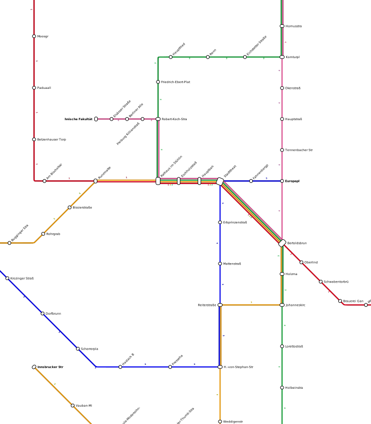 |

---

### `--base-graph` (default: `octilinear`)

The routing grid that connections follow. This determines which angles are allowed.
The `octilinear` (8-direction) grid is the original contribution of [[3]](#ref3).
The additional grid types — `ortholinear`, `orthoradial`, and sparse Hanan-based grids
(`octihanan`) — were introduced in [[4]](#ref4) together with a sparse-grid construction
that reduces grid size by up to 5x and speeds up ILP solve times accordingly.

| Value | Allowed angles | Character |
|---|---|---|
| `octilinear` | 0, 45, 90, 135, 180 degrees | Classic metro-map style [[3]](#ref3) |
| `ortholinear` | 0, 90, 180 degrees | Grid-only, very geometric [[4]](#ref4) |
| `orthoradial` | Circular + radial directions | Concentric ring layout [[4]](#ref4) |
| `quadtree` | Adaptive subdivision | Locally denser near busy stations [[4]](#ref4) |
| `octihanan` | Octilinear on Hanan grid | Sparser grid, faster ILP, more geographically faithful [[4]](#ref4) |

| `octilinear` (default) | `ortholinear` | `orthoradial` |
|---|---|---|
|  | 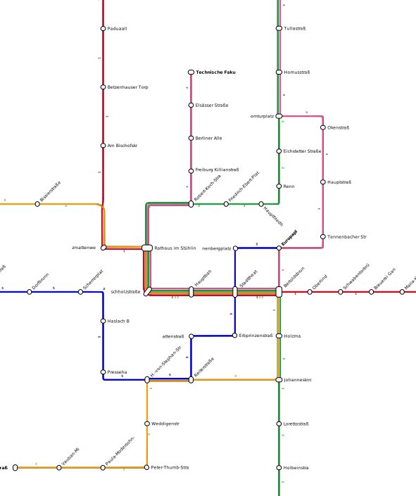 | 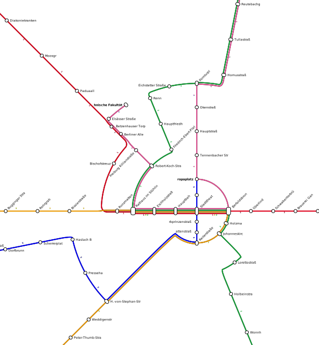 |

| `quadtree` | `octihanan` | |
|---|---|---|
| 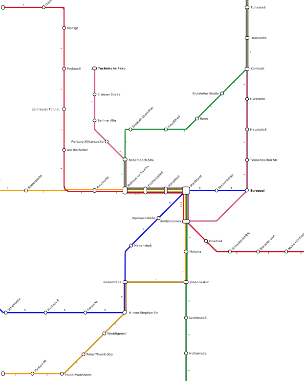 | 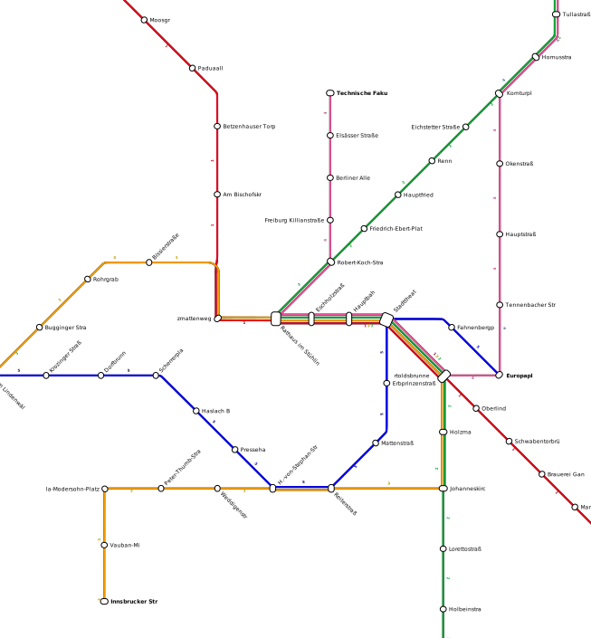 | |

---

### `--nd-move-pen` (default: 0.5)

Penalty for moving a station node away from its original geographic position.
Higher values keep stations closer to their real-world locations at the cost of
potentially less clean routing. Lower values allow the optimizer to move stations
freely for a cleaner schematic result.

| `--nd-move-pen 0` (stations move freely) | `--nd-move-pen 2` (stations stay geographic) |
|---|---|
| 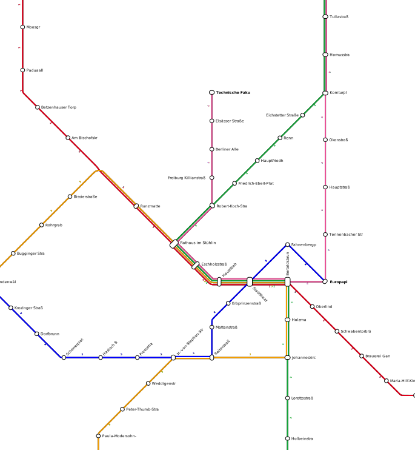 | 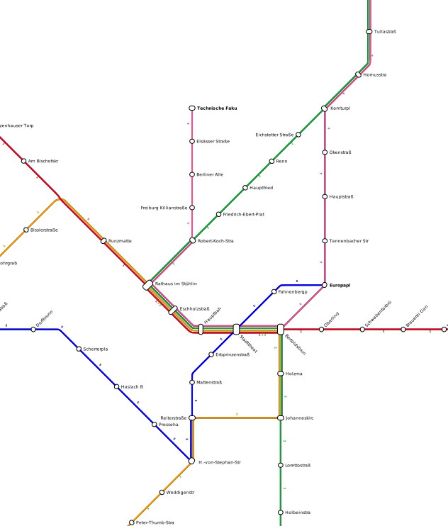 |

---

### `--max-grid-dist` (default: 3)

Maximum number of grid cells a station can be placed away from its original
geographic position. Increase this to allow more freedom in station placement
(better routing) at the cost of larger geographic distortion.

---

### `--geo-pen` (default: 0)

Penalty for routing connections in directions that deviate from the original
geographic direction. `0` means purely schematic. Higher values enforce connections
to roughly follow the real geographic bearing — a feature specifically designed to support
overlay on geographic base maps, as described in [[3]](#ref3).

| `--geo-pen 0` (purely schematic) | `--geo-pen 5` (follow geographic direction) |
|---|---|
| 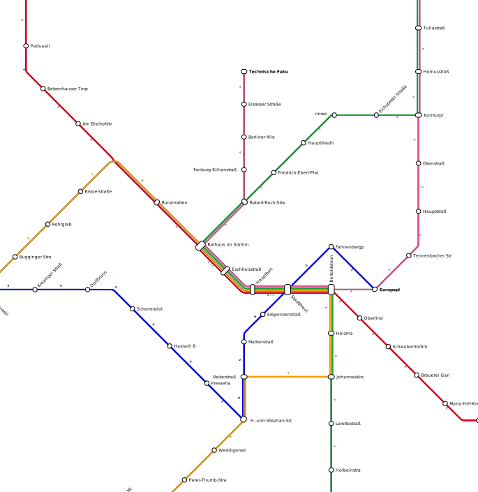 | 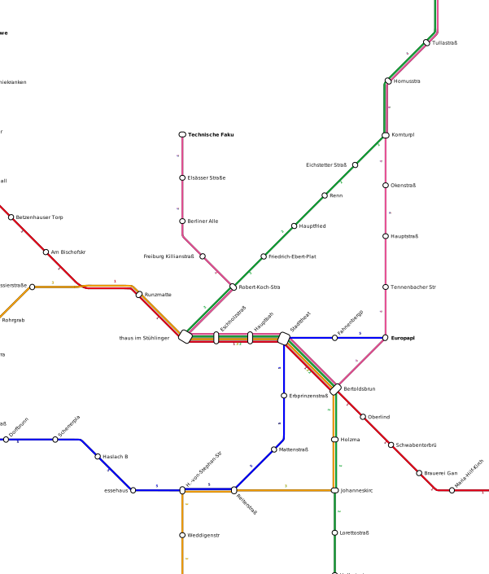 |

---

### Bend penalties

These control how much the optimizer penalizes each bend angle in the routed connections.
Higher values encourage straighter or more gently-curved routes.

| Parameter | Default | Angle |
|---|---|---|
| `--pen-180` | 0 | U-turn (180 degrees) |
| `--pen-135` | 1 | Shallow curve (135 degrees) |
| `--pen-90` | 1.5 | Right angle (90 degrees) |
| `--pen-45` | 2 | Sharp diagonal (45 degrees) |

The defaults make right-angle and diagonal bends more expensive than gentle curves.

| Low bend penalties (all angles cheap) | High bend penalties (prefer straight) |
|---|---|
| 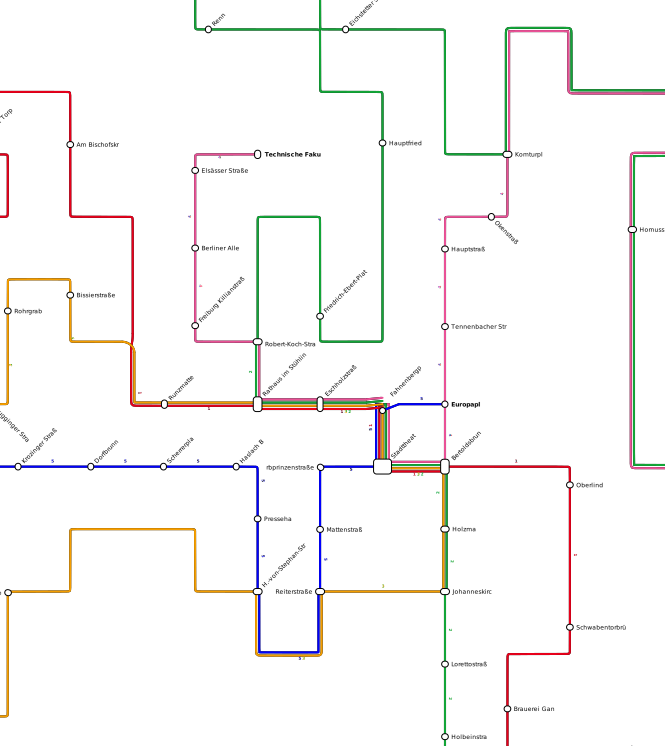 | 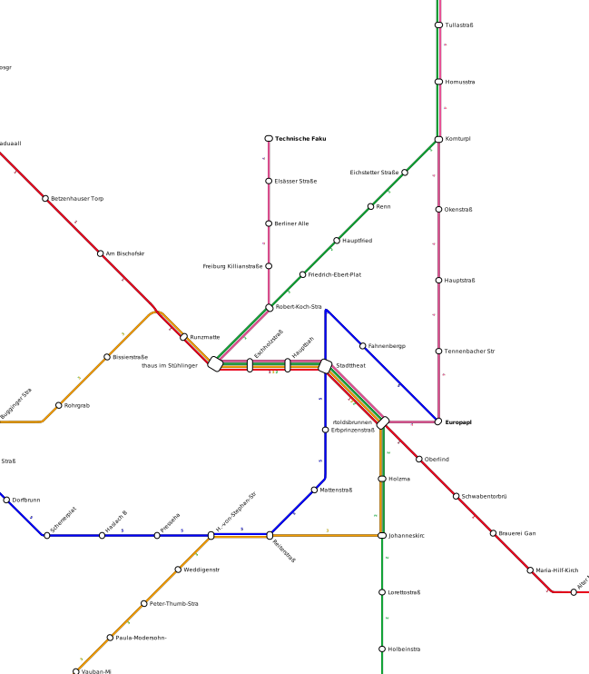 |

---

### Direction penalties

| Parameter | Default | Meaning |
|---|---|---|
| `--vert-pen` | 0 | Penalty for vertical connections |
| `--hori-pen` | 0 | Penalty for horizontal connections |
| `--diag-pen` | 0.5 | Penalty for diagonal connections |

A small diagonal penalty slightly discourages diagonal lines, which are harder to follow
than axis-aligned ones. Raise `--diag-pen` to get a more grid-like result.

---

### `--density-pen` (default: 10)

Penalty for placing stations in already-dense areas of the grid.
Higher values spread stations more evenly across the grid.
Lower values allow stations to cluster tightly where the network is dense.

| `--density-pen 0` | `--density-pen 20` |
|---|---|
| 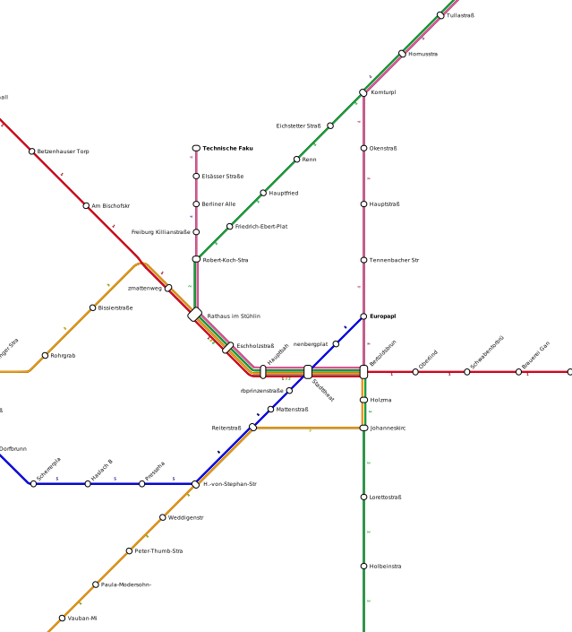 | 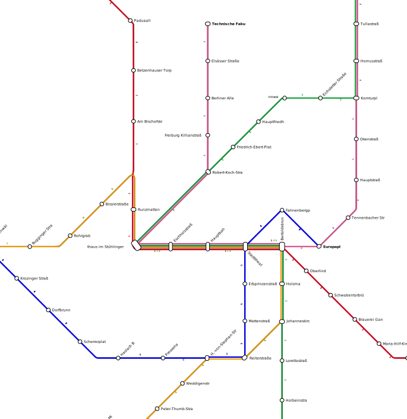 |

---

### `--loc-search-max-iters` (default: 100)

Maximum local-search improvement iterations after the initial placement.
Increase for better layouts on complex networks (at the cost of more computation time).

---

### `--edge-order` (default: `all`)

Order in which edges are processed during the heuristic placement.
Trying multiple orderings (`all`) and keeping the best result generally gives the best output.

| Value | Description |
|---|---|
| `all` | Try all methods, keep best (default) |
| `num-lines` | Process edges with most lines first |
| `length` | Process longer edges first |
| `adj-nd-deg` | Order by adjacent node degree |
| `adj-nd-ldeg` | Order by adjacent node line degree |
| `growth-deg` | Growth-based by node degree |
| `growth-ldef` | Growth-based by line degree |

---

### `--hanan-iters` (default: 1)

Number of Hanan grid iterations. More iterations add more candidate positions for
stations and can improve routing quality. Rarely needed above 2.
Only relevant when `--base-graph octihanan` is used.

---

### `--no-deg2-heur`

Disables the degree-2 node contraction heuristic. By default, degree-2 nodes
(pass-through stations with exactly two connections) are contracted before optimization
and re-inserted afterwards, reducing the problem size. Disabling this can occasionally
improve results for irregular topologies.

---

### `--restr-loc-search`

Restricts the local search to consider only station candidates within `--max-grid-dist`
of their original position. Makes the search faster but potentially reduces quality.

---

### `--obstacles`

Path to a GeoJSON file containing polygon features that the routing should avoid.
Lines will not be routed through these areas. Useful for excluding geographic features
(water bodies, parks) from the schematic layout.

---

### Error handling

| Parameter | Meaning |
|---|---|
| `--retry-on-error` | On routing failure, retry with 85% of the grid size, up to 30 times |
| `--skip-on-error` | On routing failure, skip the network component and continue |

---

### ILP solver settings (octi)

| Parameter | Default | Meaning |
|---|---|---|
| `--ilp-solver` | `gurobi` | Preferred solver: `gurobi`, `cbc`, or `glpk`. Falls back if not available. |
| `--ilp-num-threads` | `0` | Threads given to ILP solver. `0` = solver default. |
| `--ilp-time-limit` | `60` | Time limit in seconds for each ILP sub-problem. `-1` = no limit. |
| `--ilp-cache-dir` | `.` | Directory for caching ILP sub-problems between runs. |
| `--ilp-cache-threshold` | `inf` | Only cache ILP problems larger than this threshold. |

---

## `topo` — Topological Cleanup (optional)

`topo` merges nearby parallel track segments that were digitized separately
(for example, the up-track and down-track of a tram route mapped as two separate lines).
It also infers turn restrictions from the geometry.

Run `topo` when your input data has many duplicate or near-duplicate segments,
which would otherwise create visual artifacts (very thin parallel slivers in the output).

### `--max-aggr-dist` / `-d` (default: 50)

Maximum distance in meters between two track segments to consider merging them.
Larger values merge more aggressively. Use the smallest value that cleans up
your data without merging tracks that should stay separate.

---

### `--sample-dist` (default: 5)

Resolution in pseudometers used when comparing track geometries for similarity.
Smaller values are more precise but slower.

---

### `--smooth` (default: 0)

Apply geometric smoothing to the cleaned-up graph. `0` means no smoothing.
Values of 1–3 soften the output geometry before it reaches `loom` and `transitmap`.

---

### `--no-infer-restrs`

Disables automatic turn restriction inference. Turn restrictions prevent the
routing from making physically impossible turns (such as a U-turn at a terminus).
Disable this if the inferred restrictions cause routing issues.

---

### `--infer-restr-max-dist` (default: same as `-d`)

Maximum distance for edges considered when inferring turn restrictions.
Defaults to the same value as `--max-aggr-dist`. Increase independently if turn
restrictions are being missed at larger junctions.

---

### `--max-length-dev` (default: 500)

Maximum allowed length deviation in pseudometers when inferring turn restrictions.
Segments that deviate more than this in length from the expected path are excluded
from restriction inference.

---

### `--turn-restr-full-turn-angle` (default: 0)

Turn angles smaller than this threshold (in degrees) are counted as full U-turns
during turn restriction inference. Increase this to make the restriction logic
treat near-U-turns as full turns.

---

### `--turn-restr-full-turn-pen` (default: 0)

Penalty applied during turn restriction inference when a full turn is detected.
A non-zero value discourages U-turns during the inference pass.

---

### `--max-comp-dist` (default: 10000)

Two nodes further apart than this (in meters) are treated as separate network components.
Lower this to keep geographically distant parts of a network truly separate.

---

### `--random-colors`

Assigns random colors to any lines that have no color defined in the input data.

---

### `--write-components`

Writes the graph component ID as an attribute on each edge in the output GeoJSON.
Useful for diagnosing disconnected sub-networks.

---

### `--write-components-path`

Writes each network component as a separate GeoJSON file to the given directory path.

---

## Combining parameters

**Clean schematic diagram (transit authority style):**
```
loom --optim-method comb-no-ilp
octi --grid-size 100% --base-graph octilinear --nd-move-pen 0.5 --diag-pen 0.5
transitmap --labels --line-width 20 --line-spacing 10 --outline-width 1 --smoothing 1
```

**Geographic map with clean routing:**
```
topo --max-aggr-dist 50
loom --optim-method comb-no-ilp
transitmap --labels --line-width 15 --line-spacing 8 --outline-width 1 --smoothing 2
```

**Minimalist diagram:**
```
loom --optim-method comb-no-ilp
octi --grid-size 80% --base-graph octilinear
transitmap --line-width 20 --line-spacing 10 --outline-width 0 --tight-stations --no-render-node-connections
```

**High detail / large format print:**
```
loom --optim-method comb-no-ilp
transitmap --labels --line-width 40 --line-spacing 20 --outline-width 2 --smoothing 1 --station-label-textsize 80
```

**Overlay on a geographic base map (maintain geographic orientation):**
```
loom --optim-method comb-no-ilp
octi --grid-size 100% --geo-pen 3 --nd-move-pen 1
transitmap --labels --line-width 20 --line-spacing 10 --smoothing 1
```

---

## References

<a id="ref1"></a>**[1]** Hannah Bast, Patrick Brosi, Sabine Storandt.
*Efficient Generation of Geographically Accurate Transit Maps.*
26th ACM SIGSPATIAL International Conference on Advances in Geographic Information Systems (SIGSPATIAL 2018), Seattle, WA, November 2018.
[PDF](http://ad-publications.informatik.uni-freiburg.de/SIGSPATIAL_transitmaps_2018.pdf)

Introduces the LOOM pipeline and the line-ordering ILP. Describes the construction of the line graph, the crossing/separation penalty objective, and engineering reductions that cut the ILP from 229,000 constraints (NYC subway) to ~3,700. Covers the parameters of the `loom` tool.

<a id="ref2"></a>**[2]** Hannah Bast, Patrick Brosi, Sabine Storandt.
*Efficient Generation of Geographically Accurate Transit Maps* (extended version).
ACM Transactions on Spatial Algorithms and Systems, Vol. 5, No. 4, Article 25, September 2019.
[PDF](http://ad-publications.informatik.uni-freiburg.de/ACM_efficient%20Generation%20of%20%20Geographically%20Accurate%20Transit%20Maps_extended%20version.pdf)

Extended journal version of [1]. Adds local transformation rules that resolve partial line orderings before the ILP, further reducing solve time. Evaluates on six networks with solution spaces up to 2x10^267 — all solved optimally in under a second, enabling interactive use in map editors.

<a id="ref3"></a>**[3]** Hannah Bast, Patrick Brosi, Sabine Storandt.
*Metro Maps on Octilinear Grid Graphs.*
Eurographics Conference on Visualization (EuroVis 2020), Computer Graphics Forum, Vol. 39, No. 3.
[PDF](http://ad-publications.informatik.uni-freiburg.de/EuroVis%20octi-maps.pdf)

Introduces the `octi` schematization approach: placing stations on an octilinear grid (0/45/90/135/180 degree directions) and routing connections via ILP or heuristic shortest paths. Introduces geographic penalties (`--geo-pen`) for overlaying schematics on geographic base maps, and evaluates on Freiburg, Stuttgart, Vienna, Berlin, London, and Sydney.

<a id="ref4"></a>**[4]** Hannah Bast, Patrick Brosi, Sabine Storandt.
*Metro Maps on Flexible Base Grids.*
17th International Symposium on Spatial and Temporal Databases (SSTD 2021), August 2021.
[PDF](http://ad-publications.informatik.uni-freiburg.de/SSTD_Metro%20Maps%20on%20Flexible%20Base%20Grids.pdf)

Extends [3] to additional grid types: `ortholinear` (90-degree only), `orthoradial` (circular/radial maps), and sparse Hanan-based grids (`octihanan`). The sparse grid construction reduces grid size by up to 5x and ILP solve time accordingly while maintaining near-optimal layout quality. Covers the `--base-graph` parameter.

<a id="ref5"></a>**[5]** Anton et al. (Transit App).
*How We Built the World's Prettiest Auto-Generated Transit Maps.*
Transit App Engineering Blog, 2018.
[Link](https://blog.transitapp.com/how-we-built-the-worlds-prettiest-auto-generated-transit-maps-12d0c6fa502f/)

Practitioner account of building automated transit maps for 55+ cities. Describes route shape inference from OSM, network skeletonization in pixel space, ILP-based line ordering (independently arriving at the same approach as [1]), and circular arc rendering to keep parallel lines truly parallel through bends. A useful companion read to understand the visual goals these algorithms pursue.
